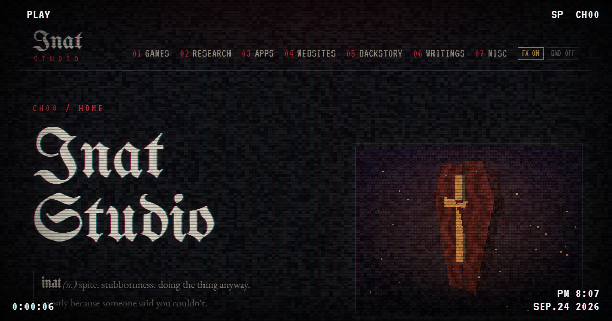

# Inat Studio

Source for [petardeveloper.github.io](https://petardeveloper.github.io), the home of Inat Studio. My games, research papers, apps, websites and whatever else I end up making, all on one tape.

*inat* is Serbian for spite. Stubbornness. Doing the thing anyway.



## what's in it

- **a CRT / VHS overlay** on every page: scanlines, grain, flicker, a tracking band that rolls down the screen now and then, and a VCR on-screen display with a tape counter that keeps running across pages
- **a boot tape** on the home page. Plays once per visit, any key skips it
- **a spinning PS1 coffin**, drawn by a tiny software renderer into a 160x120 canvas: affine texture mapping, vertices snapped to whole pixels, painter's sort instead of a z buffer and a 4x4 Bayer dither down to 4 bits per channel. You can drag it
- **every section is a channel**. Switching pages plays a burst of static, fast forward or rewind depending on which way you're going
- **set pieces instead of cards**: itch games are burned CD-Rs in paper sleeves, Steam games are PS1 jewel cases, papers are archive case files with a DOS index, websites are CRT TVs, the backstory is a camcorder tape
- **sound**, all synthesized with the Web Audio API. Off by default
- **an FX switch** in the header that kills the motion and remembers it. It's off from the start if your OS has reduce motion turned on
- **the Steam widget only loads when you click it**, so nobody gets Steam's cookies just for scrolling past
- one old cheat code still works

## built with

Plain HTML, CSS and JavaScript. No framework, no build step, no dependencies.

Fonts are UnifrakturMaguntia, Pirata One, VT323, EB Garamond and Permanent Marker, from Google Fonts.

## layout

```
index.html        home
games.html        itch.io + steam
research.html     papers
apps.html         apps
websites.html     websites
backstory.html    backstory
writings.html     writings
misc.html         contact, links, colophon
404.html          lost tape

css/style.css     all of the styling
js/main.js        overlay, on screen display, page static, boot tape, sound
js/psx.js         the coffin renderer

img/              covers, screenshots, photos
files/papers/     the papers as pdf
files/apps/       app downloads
```

## running it locally

Any static server works:

```
python -m http.server 8000
```

then open http://localhost:8000

## hosting

GitHub Pages, straight from `main`. `.nojekyll` keeps Jekyll out of it. `404.html` has `<base href="/">` because Pages serves it from whatever path was requested.
